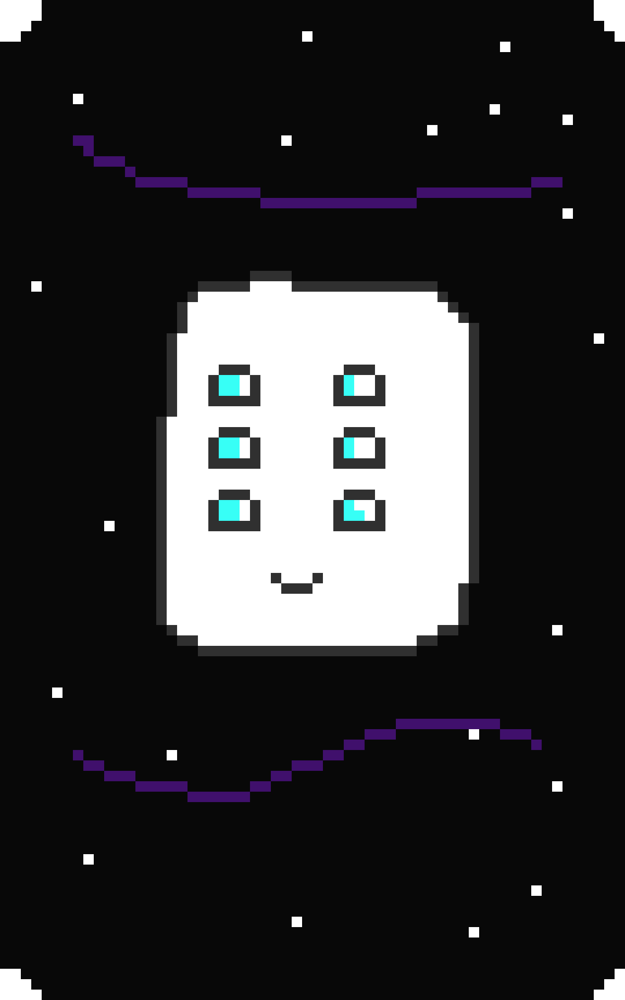
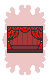
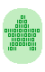
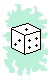
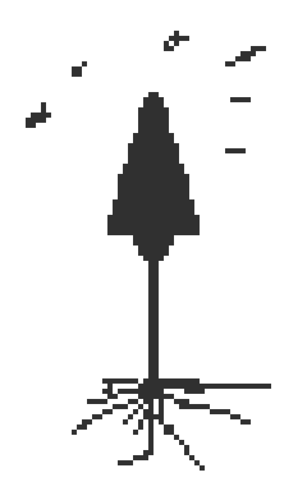
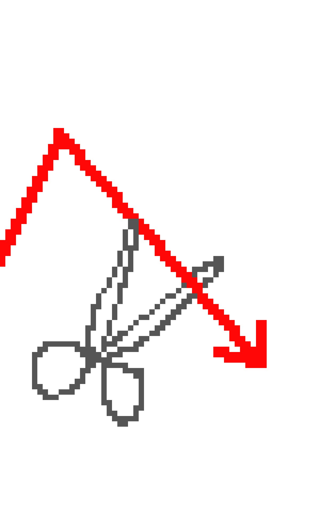
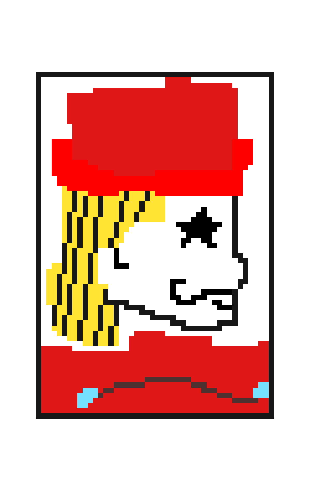
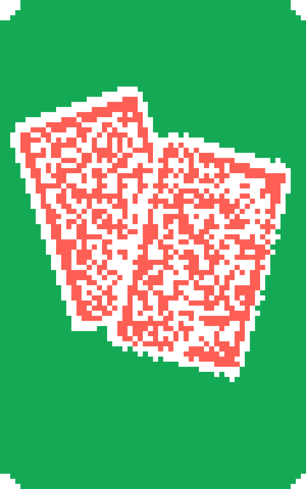
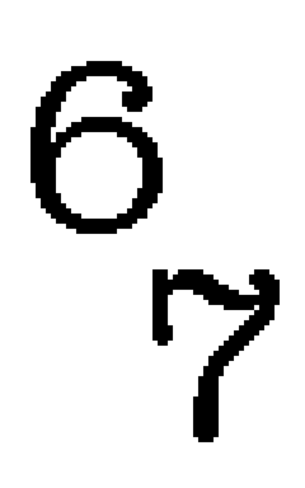
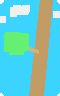

# Joker Reference

This document lists the implemented jokers in the canonical game engine at
`stellatro-game/stellatro_game/jokers.py` and shows:

- Joker image
- Joker name
- In-code description
- When the effect is applied

Participants can use this as a quick lookup when building drafting logic or
estimating hand value.

## Phase Meanings

- `pre_card_phase`: changes or retriggers cards before they are scored.
- `apply_card_phase`: applies while each scored card is being processed.
- `post_card_phase`: applies after the hand has been evaluated and card scoring
  is complete.
- `none`: no special phase hook; the joker currently has no custom effect.

Some jokers are lineup-aware: they can inspect the other jokers you own while
scoring. Those effects still run in one of the three phases above.

## Important Note

This file covers all implemented joker classes in the canonical engine. The
current `generate_jokers()` helper samples directly from `ALL_JOKER_CLASSES`,
so every joker listed here can appear in the normal draft pool.

## All Implemented Jokers

| Image | Name | Description | Phase |
| --- | --- | --- | --- |
|  | Regular Joker | No special abilities. | `none` |
|  | Jolly Joker | +4 Mult if the full played hand includes a Pair. | `post_card_phase` |
|  | Sly Joker | +20 Chips if the full played hand includes a Pair. | `post_card_phase` |
|  | Zany Joker | +8 Mult if the full played hand includes Three of a Kind. | `post_card_phase` |
|  | Cheeky Joker | +6 Mult if the full played hand includes Two Pair. | `post_card_phase` |
|  | Witty Joker | +10 Mult if the full played hand includes a Straight. | `post_card_phase` |
|  | Daring Joker | +10 Mult if the full played hand includes a Flush. | `post_card_phase` |
|  | Merry Joker | +20 Chips if the full played hand includes Three of a Kind. | `post_card_phase` |
|  | Jovial Joker | +18 Chips if the full played hand includes Two Pair. | `post_card_phase` |
|  | Lively Joker | +30 Chips if the full played hand includes a Straight. | `post_card_phase` |
|  | Vibrant Joker | +30 Chips if the full played hand includes a Flush. | `post_card_phase` |
|  | Diamond Joker | Scored cards with Diamond suit give +4 Mult. | `apply_card_phase` |
|  | Heart Joker | Scored cards with Heart suit give +4 Mult. | `apply_card_phase` |
|  | Club Joker | Scored cards with Club suit give +4 Mult. | `apply_card_phase` |
|  | Spade Joker | Scored cards with Spade suit give +4 Mult. | `apply_card_phase` |
|  | Walkie Talkie | Each scored 10 or 4 gives +10 Chips and +4 Mult when scored. | `apply_card_phase` |
|  | Sock and Buskin | Retrigger all scored face cards. | `pre_card_phase` |
|  | Sun God | For every heart card scored, get X1.5 Mult | `apply_card_phase` |
|  | Eigth College | Each scored 8 gives +48 chips and +8 Mult when scored | `apply_card_phase` |
|  | PhotoGraph Joker | First scored face card gives X2 Mult when scored | `pre_card_phase`, `apply_card_phase` |
|  | Flower Pot | x3 Mult if the full played hand contains a diamond, heart, spade, and club | `post_card_phase` |
|  | The Duo | If the full played hand contains a pair, x2 Mult | `post_card_phase` |
|  | The Trio | If the full played hand contains a Three of a Kind, x2.5 Mult | `post_card_phase` |
|  | The Tribe | If the full played hand contains a Flush, x3 Mult | `post_card_phase` |
|  | The Order | If the full played hand contains a Straight, x3 Mult | `post_card_phase` |
|  | UC Socially Dead | If the full played hand contains only a High Card, x8 Mult | `post_card_phase` |
|  | Bit Byte | Face cards give +4 Mult, number cards give +8 Chips. | `apply_card_phase` |
|  | Student ID | If the full played hand contains a single ace and no face cards, +25 Mult, +25 chips | `post_card_phase` |
|  | Seltzer | Retrigger each played card that has rank <= 8 | `pre_card_phase` |
|  | Last Lecture | Final played card gets retriggered 2 extra times | `pre_card_phase` |
|  | Dining Hall Prices | Increases played cards with rank 2,3,4,5 by 5 | `pre_card_phase` |
|  | Half Joker | +15 Mult if scored hand is either all <= 8, or >= 9 | `post_card_phase` |
|  | Fibonacci Joker | Each played Ace, 2, 3, 5, or 8 gives +5 Mult when scored. | `apply_card_phase` |
|  | Scary Face Joker | Each face card gives +30 chips. | `apply_card_phase` |
|  | Mirror | Face Cards give +20 mult, but -10 chips | `apply_card_phase` |
|  | Plasma | Balance chips and mult, diminished return if chips and mult are far apart | `post_card_phase` |
|  | Star Plasma | Gain 2x stellas in each played card | `pre_card_phase` |
|  | Jam Session | +6 mult for each extra trigger on scored cards. | `post_card_phase` |
|  | Spotlight | First played face card gains +10 Chips and +4 Mult for each other face card in full played hand. | `pre_card_phase`, `apply_card_phase` |
|  | Color Theory | x1.25 Mult for each additional suit represented in played hand. | `post_card_phase` |
|  | Study Group | +12 Chips for each distinct rank among scored cards. | `post_card_phase` |
|  | Group Project | +8 Chips and +2 Mult for each scored card with rank 8 or lower. | `post_card_phase` |
|  | Encore | Final card gets retriggered once for each other card sharing its suit. | `pre_card_phase` |
|  | Wish Upon a Star | Lowest-ranked played card gains 8 Stella before scoring. | `pre_card_phase` |
|  | Binary Star | Even played cards gain 2 stella | `pre_card_phase` |
|  | Pips | Played cards gain stella equal to their rank, but give base 0 chips when scored. | `pre_card_phase`, `apply_card_phase` |
|  | Report Card | Each ace gives the first card in full played hand 11 stella | `pre_card_phase` |
|  | Cache Coherence | Played cards of the same suit have the same number of stella (max) | `pre_card_phase` |
|  | Stargazing | Each played card's stella gives one retrigger | `pre_card_phase` |
|  | Boiling Point | If total number of stella across played cards is greater than 12, x3 Mult | `post_card_phase` |
|  | Galaxy | +0.25x Mult per stella across played cards, base 1x Mult | `post_card_phase` |
|  | Popcorn | +30 Mult, -5 per stella on played cards | `post_card_phase` |
|  | Starcorn | Each card gives (rank * stella) mult | `apply_card_phase` |
|  | Supernova | Each card with stella gives x(1.1)^stella mult when scored. | `apply_card_phase` |
|  | Snowball | +40 Chips per stella on played cards | `post_card_phase` |
|  | Constellation | Gain +8 chips and +3 mult for each Stella on scored cards. | `post_card_phase` |
|  | Arrowhead | Played cards with Spade suit give +18 Chips. | `apply_card_phase` |
|  | Loss Cut | For every card that wasn't scored, gain +30 Chips. | `post_card_phase` |
|  | Lock In | All played cards score, no matter what hand is played. | `scores_all_cards` |
|  | Starjack | The first face card gains 10 stella. | `pre_card_phase` |
|  | Blackjack | x4 Mult if all played cards' score adds up to 21. | `post_card_phase` |
|  | Six Seven | If the full played hand contains a 6 and a 7, gain +67 Mult | `post_card_phase` |
|  | Thrice Twice | If the full played hand contains a Full House, each card gains 3 stella | `pre_card_phase` |
|  | Fallen Star | Lowest scored card gains stella equal to the highest scored rank, and highest scored card gains stella equal to the lowest scored rank. | `pre_card_phase` |
|  | Star Fish | Scored cards in pairs gain +2 stella, triplets gain +4 stella, and quads gain +8 stella. | `pre_card_phase` |
|  | Branch Out | Each played card carries half of the previous played card's stella. | `pre_card_phase` |
|  | Anya | Each scored card gives +4 Mult for every other played card sharing its rank or suit. | `pre_card_phase`, `apply_card_phase` |

<!-- Generated from jokers.py and joker_sprites.py; 67 jokers. -->
